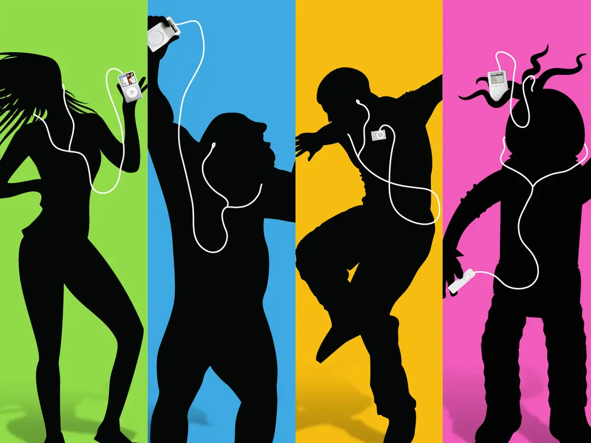

## Creative Coding 2: Custom Pixel

My precedents starts with being inspired by the old iPod ads from 2006

I was intrigued by the colours and used this as a starting point for my design. The pictures I decided to use were taken by mme last summer for my friends jewellrey collection. I decided to make the masks around the jewellery and teach the AI how to interpret the jewellery.

The masks only took me a couple runs through for the AI to generate some decent material. From here I had begun the code for the visual effects. I started with making sure that background was the original image so that I could preserve the original image and have effects over the masked areas.

Starting from the initial mosaic dots that the assignment came with, the lens flare. This ended up being more of a splatter effect as I randomized a lot of the variables besides the shape. This created the visual effect I wanted. I added the embossment to create the splatter effect and then I did the lensflares but expanded them across the canvas to more resemble rain. This was also randomized so that everytime I render the images I would get different patterns.

I decided to name this work digital rain

